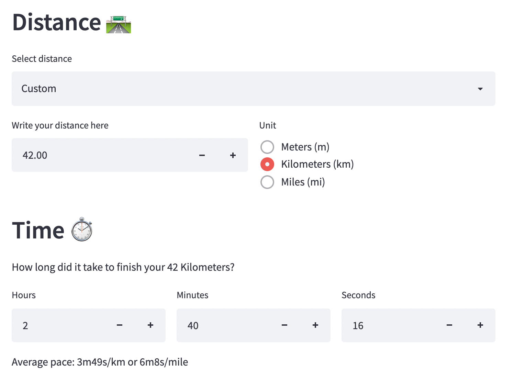
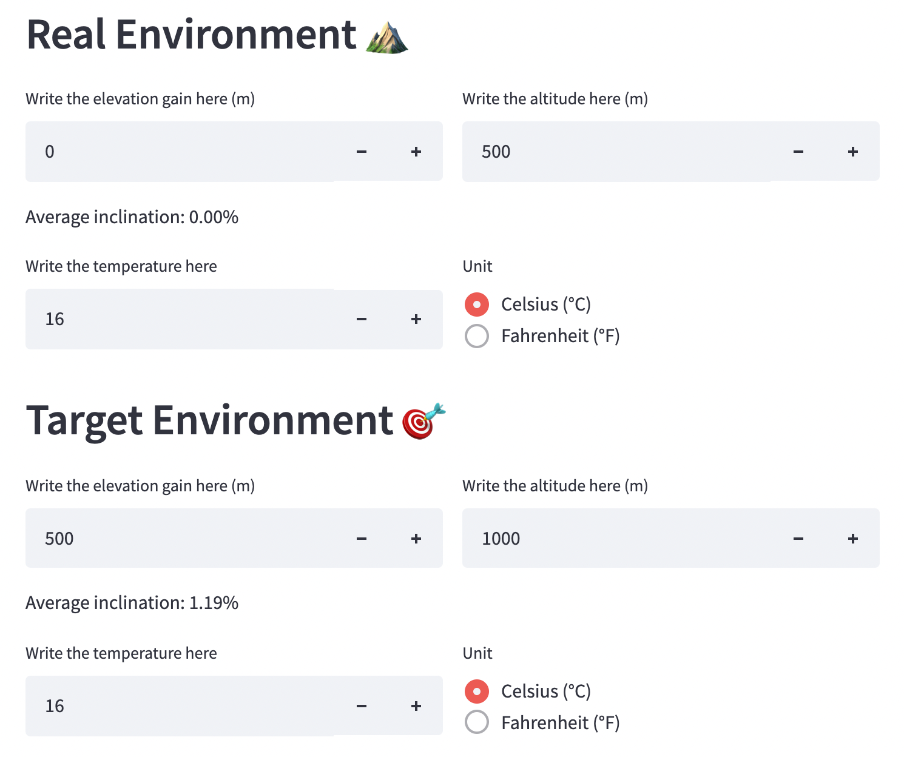

# Running Performance Calculator

[](https://share.streamlit.io/davide97l/running-performance-calculator/main/app/main.py)

👉 Have you ever wondered if you ran 10km at 2000m altitude, how fast would you ran the same distance at lower altitudes? How would elevation gain and temperature affect your performance? 🤔

👉 The goal of this application is to calculate your running pace and time would change given different elevation gain, altitude and temperature.

<p align="center">
    
</p>
<p align="center">
    
</p>

<h3 align="center">
    Try it out: <br>
    <a href="https://share.streamlit.io/davide97l/running-performance-calculator/main/app/main.py">https://share.streamlit.io/davide97l/running-performance-calculator/main/app/main.py</a>
</h3>


## Features

- Support for default or custom distances
- Compute pace and time according to elevation gain, altitude and temperature
- Clean and user-friendly interface
- The author has over 10 years or running experience including track, road, and trail running

---

## Usage

Clone this repository and set up the environment:
```bash
git clone https://github.com/davide97l/running-performance-calculator
cd running-performance-calculator
pip install streamlit
```
Run it locally:
```bash
streamlit run streamlit_app.py
```

---

## Support
If you found this project interesting please support me by giving it a :star:, I would really appreciate it :grinning: